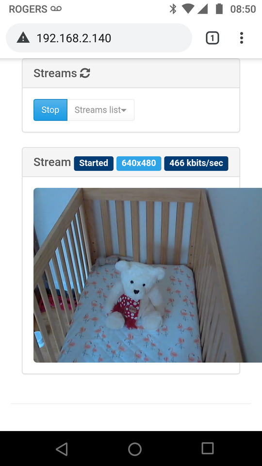

# Raspberry PI baby monitor

This service works on Raspberry PI, but can be adopted for a PC with Debian/Ubuntu
It is assumed that a webcam with a microphone is attached to USB
And supported by linux kernel, creating /dev/video0 and default audio capture device (ALSA)

## Install dependencies (Raspbian)

```
# prebuilt janus dependencies
apt install libconfig-dev libmicrohttpd-dev libssl-dev

# gst streamer
apt  install gstreamer1.0-plugins-good gstreamer1.0-plugins-bad \
             gstreamer1.0-omx-rpi gstreamer1.0-omx-rpi-config  \
             gstreamer1.0-rtsp gstreamer1.0-alsa gstreamer1.0-libav gstreamer1.0-omx 


# some libraries need to be compiled from source
# libnice 0.1.16
curl https://libnice.freedesktop.org/releases/libnice-0.1.16.tar.gz -o libnice-0.1.16.tar.gz -L
tar xzf libnice-0.1.16.tar.gz
cd libnice-0.1.16
./configure --prefix=/usr --no-create --no-recursion
make
sudo make install # will install into /usr
cd ..

# libsrtp 2.3.0
curl https://github.com/cisco/libsrtp/archive/v2.3.0.tar.gz -o libsrtp-2.3.0.tar.gz -L
tar zxf libsrtp-2.3.0.tar.gz
cd libsrtp-2.3.0
./configure --prefix=/usr --enable-openssl
make 
sudo make install # will install into /usr
cd ..
```

## Compiling Janus-gateway itself

```
curl https://github.com/meetecho/janus-gateway/archive/v0.10.9.tar.gz -o janus-gateway-0.10.9.tar.gz -L
tar zxf janus-gateway-0.10.9.tar.gz
cd janus-gateway-0.10.9
./autogen
./configure --prefix=/opt/janus --enable-libsrtp2
make 
sudo make install # will install into /opt/janus
```

## Define janus configuration

Janus WebRTC server will be listening on port 8188 (WebSockets interface) and 8088(REST API), by
default these ports are open to the whole world, so don't run it on your publicly exposed web computer.

```
cp janus_etc/janus.plugin.streaming.jcfg  /opt/janus/etc/janus/janus.plugin.streaming.jcfg
```

## Capturing live stream using hardware acceleration

We are going to capture whatever video is coming from `/dev/video0` device, by default this
is the first web camera attached to the raspberry pi. If you are using RaspiCAM it can also be
visible as this device.

gstreamer can capture uncompressed video stream from `/dev/video0` and compress it using hardware acceleration on raspberry pi using `omxh264enc` plugin. We are instructing the camera to capture
using 640x480 format with 30 frames per second, and capture audio using first ALSA device (microphone of your webcam) (this command will be run by `systemd` , using `capture.service` below):
```
gst-launch-1.0     \
  -v v4l2src device=/dev/video0 ! \
      video/x-raw,width=640,height=480,framerate=30/1 ! \
      videorate ! videoconvert !\
      omxh264enc target-bitrate=240000 control-rate=variable !\
      h264parse !\
      rtph264pay config-interval=1 pt=96 !\
      udpsink host=127.0.0.1 port=8004 \
    alsasrc device=plughw:1  ! \
      audioresample quality=1 ! \
      audio/x-raw,rate=16000,channels=1 ! \
      opusenc bitrate=10000 ! \
      rtpopuspay ! \
      udpsink host=127.0.0.1 port=8002
```
On raspberry pi 3 this capture uses approximately 40% of a single cpu core.

If you want to run this on a system without hardware acceleration for h264 encoding (i.e an Intel PC).
Then you will have to use software codec, replace `omxh264enc` with `x264enc` in the `capture.service`

## Create services for systemctl

```
sudo cp janus.service /etc/systemd/system/janus.service
sudo cp capture.service /etc/systemd/system/capture.service

sudo systemctl daemon-reload
sudo systemctl enable janus
sudo systemctl enable capture
```

## Web server setup

We are using NGINX but any HTTPD server will do the job.
Copy the contents of html directory into the target location.
All the processing will handled by janus and web browser. It is possiblt to use NGINX to serve as a reverse-proxy for Janus control API , if you don't want to expose too many ports.

This will install simple index.html page to the default location of the NGINX server root:
The index.html is configured to connect directly to the Janus WebSockets interface and fall-back to REST api
if it fails. It can be configured to use reverse-proxy feature of NGINX

```
sudo cp -r html/* /var/www/html/
```

NGINX configuration `/etc/nginx/sites-enabled/default`

```
...
server {
    ...
        listen 80 default_server;
        listen [::]:80 default_server;
        index index.html;
    ...
}
...
```

**Optional**: reverse proxy setup: `/etc/nginx/sites-enabled/default`, if you don't want to expose janus REST API

```
       location /janus-api {
         proxy_set_header X-Real-IP $remote_addr;
         proxy_set_header Host $host;
         proxy_set_header X-Forwarded-For $proxy_add_x_forwarded_for;
         proxy_set_header X-Forwarded-Proto $scheme;
         proxy_http_version 1.1;
         proxy_set_header Upgrade $http_upgrade;
         proxy_set_header Connection "upgrade";
         proxy_set_header Host $host;
         proxy_redirect off;
            proxy_pass         http://127.0.0.1:8088;
        }
```

If you decided to use the reverse proxy setup you will need to edit `/opt/janus/etc/janus/janus.transport.http.jcfg`:

```
...
general {
    ...
  base_path = "/janus-api"
    ...
}
...
```

## It's all done

Navigate to the http://pi.local , or use local IP address of your raspberry pi and start watching the live feed.


